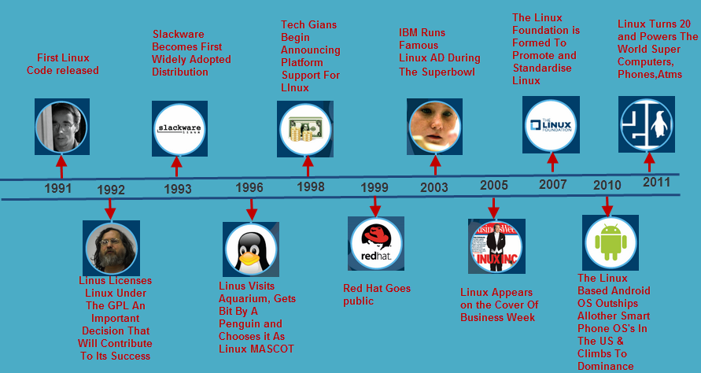

# Deliverable 1

## Introduction
Project will demonstrate how to use Ubuntu as an everyday operating system. It will include how to update Ubuntu and its best practices. Also, will explain how to connect your computer to the internet and perform tasks. The tasks can vary from internet browsing to remote assistance. How to get help for your Ubuntu machine will be included as well.

## Project hardware and software requirements
- computer that can virtualize
- hypervisor

## What is Linux?
Linux is an operating system that can be found everywhere. It is one of the most popular operating systems. An operating system is what manages the communication from your software to your hardware. Linux has many different versions and is open source. It is also one of the easiest to install out of all the operating systems. 

### Short history of linux

Brief history of linux.

### Linux distribution
* **Slackaware**: Advanced linux operating system. It's top priority is ease of use and stability. Has the capacity to be used as a desktop workstation or up to a machine room server.
* **Debian**:High quality operating system. Users can pick and chose which packets to download. It is free to use and redistribute. 

> **Debian Based Linux Distribution**
> Ubuntu: Complete free linux system. It is suitable for both desktop and server use. Has thousands of software and covers every standard desktop application such as word processing applications to internet access applications.
> Kali Linux: Open source, focused on advanced penetration testing and security auditing. Contains several hundred tools targeted towards different information security tasks.

* Red Hat Enterprise Linux:Reduces deployment friction and costs while speeding time to value for critical workloads. Enterprise linux operating system.
> Fedora: Created 2003. Focused on security. Very popular choice for web servers.

## Open Source VS Closed Source
Open source is software with source code that anyone can enhance, inspect, and modify. It embraces the principle of open exchange. Closed Source is also known as proprietary. It is the kind of software that does not let you modify source code.

### Advantages of open source
- community
- transparency
- reliability
- better security
- cost effective 

### Advantages of closed source
- user friendly
- security
- support
- testing
- updates
  
## The Free software movement
The Free software movement is computer users deserving the freedom to form a community. To be able to have the freedom to change source code and redistribute it as you wish. It gives you the option to be able to publish improved versions so other people can use them.

## Sources
- https://www.elprocus.com/linux-operating-system/ 
- https://www.linux.com/what-is-linux/
- http://www.slackware.com/info/
- https://www.debian.org/doc/manuals/debian-faq/basic-defs.en.html
- https://help.ubuntu.com/lts/installation-guide/s390x/ch01s01.html
- https://www.kali.org/docs/introduction/what-is-kali-linux/
- https://www.redhat.com/en/technologies/linux-platforms/enterprise-linux
- https://www.ntchosting.com/encyclopedia/hosting/fedora-linux-based-operating-system/
- https://opensource.com/article/17/8/enterprise-open-source-advantages
- https://www.hitechwhizz.com/2021/05/6-advantages-and-disadvantages-drawbacks-benefits-of-closed-source-software.html