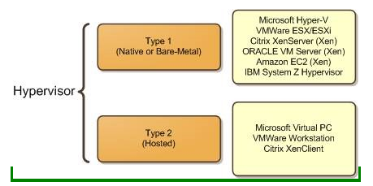

## What is Virtulization?

<br>
Virtualization is the replication of hardware to simulate a virtual machine inside a physical machine. There are two general types of virtualization depending on where the virtualizing takes place, server-side or client-side. The host operating system can host one or more virtual machines and shares physical resources with them. The operating system inside a virtual machine is called the guest operating system. A hypervisor is needed to mange one or more guest operating systems. 
<br>

### Types of Virtualization

- **Client side virtualization:** Software is installed on a computer to manage virtual machines. The machine can run multiple guest operating systems. The computer needs a hypersivor to manage the guest operating systems, The computer also needs to have enough RAM and storage, and a capable CPU to be able to host.
<br>

- **Server side Virtualization:** The process of restructuring a single server into smaller isolated servers. Servers take up a lot of space and require proper maintenance, making this option significantly more costly for organizations.
<br>

### Hypervisor
Manages the virtual platform and guest operating systems. Allows you to run multiple guest operating systems shared by a single hardware host. The hypervisor handles resources and memory allocation for the virtual machines. It also provides an interface for higher level administration and monitoring tools. There are two types.
<br>
* Type 1: Runs on hardware 
<br>
* Type 2: Runs on host operating system
<br>

## Virtualbox
<br>
VirtualBox is a type 2 virtualization product that can be used at home or enteprise. It is open source. It can run on Windows, linux, Mac, and Solaris. Supports numerous guest operating systems.
<br>
<br>
<br>
<br>
<br>
<br>
<br>
<br>
<br>


### How to install virtualbox in Windows 10
1) Download installer from [Virtualbox.org](httops://www.virtualbox.org/) 
2) Once Installer is done downloading. Install extension pack. 
3) From downloads folder run installer
4) Click on next and chose location. Default is recommended and choosing desktop icon is optional.
5) Continue by clicking next and choose "yes" when warned about network interface card. Then click install and yes.
6) wait for installation to finish and launch virtualbox.

### How to create a virtual machine 
1. Make sure virtual box is installed 
2. Chose operating system that you wish to run on host
3. Download files needed for guest operating system and run virtual box
4. Create new virtual machine through virtualbox and fix settings when completed.


## Installing Ubuntu in Virtualbox
1. Step 1: Download Ubuntu desktop from [ubuntu.com](https://ubuntu.com/download/desktop) 
2. Step2: open virtual box anc click on new
3. Step 3: Chose a name, make sure type is Linux, and version is Ubuntu(64-bit)
4. Step 4: chose memory size, recommended is 2048 MB and click next
5. Step 5: Hard disk screen select 'create a virtual hard disk now' and click create
6. Step 6: Hard disk file type screen select VDI and click next.
7. Step 7: Storage on physical hard disk screen select dynamically allocated and click next.
8. Step 8: File location and size screen select 50mb but depends how much space you have available and click create.
9. Step 9: adjust settings as desired and your new virtual machine is ready.

### Updating Ubuntu
The following command is used to update Ubuntu. You need special privelegies so 'sudo' command is needed. It gives you temporary root user access. 'Apt' is the program that will be used for the update and manage software. 'Update' downloads package information from the correct sources. If you wish to run another command in the same line then we use ';' to seperate them.  
<br>


### Installing Software in Ubuntu
* Installing command examples 
  the install option install the specified package
<br>
<br>

* Searching for software
Use the following command to search for specific or related programs that are available to download. 
<br>

* Deleting software  
    * `sudo apt remove + packge name`
        * example:
          * `sudo apt remove vlc` will remove the vlc package 
    * To remove and purge a packge use:
```
sudo apt remove vlc
sudo apt vlc
sudo apt autoremove
```

### Basic linux commands

### Navigating the filesystem 

<br>

### Managing files and directories 

#### mkdir
* Description: used for creating directories.
* Usage: `mkdir + option + new directory path`
* Examples: 
  * Create a directory in the present working directory
    * `mkdir Classes/`
  * create a parent directory and child directory
    * `mkdir Classes/cis/homeworks`
    * run tree command to see new folders.

#### touch
* Description: used for creating files  
* Usage: `touch list`
* Examples: to create several files
  `touch list_of_cars.txt script.py names.csv`


#### rm
* Description: removes files
* Usage: `rm`
`rm -r + directory name` removes non-empty directories
* Examples: `rm list` removes a file
  
#### rmdir
* Description: removes empty directories
* Usage:  `rmdir + file path` 
* Examples: `rmir Downloads/games`

#### mv
* Description: moves and renames directories
* Usage: `mv + source + destination'
* Examples: `mv Downloads/homeowrk.pdf Documents/`

#### cp
* Description: copies files/directories from a source to a destination
* Usage: `cp + files to copy + destination`
* Examples: `cp Downloads/wallpapers.zip Pictures/`
  
#### In
* Description: data structure contains all information about a file except the file name and its content
* Usage: `-i`
* Examples: `stat script.sh`

#### man: 
* Description: manual pages taht describe  linuz shell commands, executable programs, system calls, and special files. 
* Usage: `man + command`
* Examples: `man ls`


## Works Cited (resources)
* https://www.cnblogs.com/popsuper1982/p/3800230.html
* https://www.netcov.com/server-virtualization-and-its-importance/