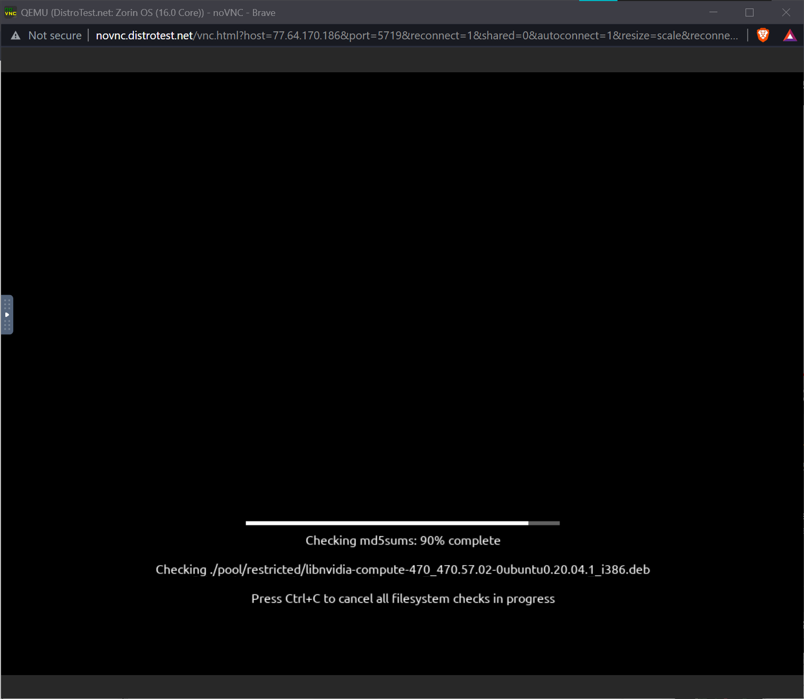
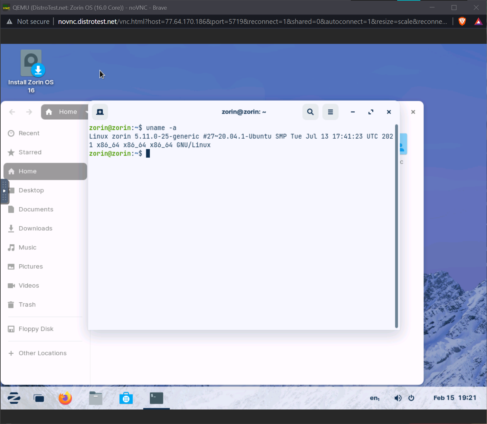
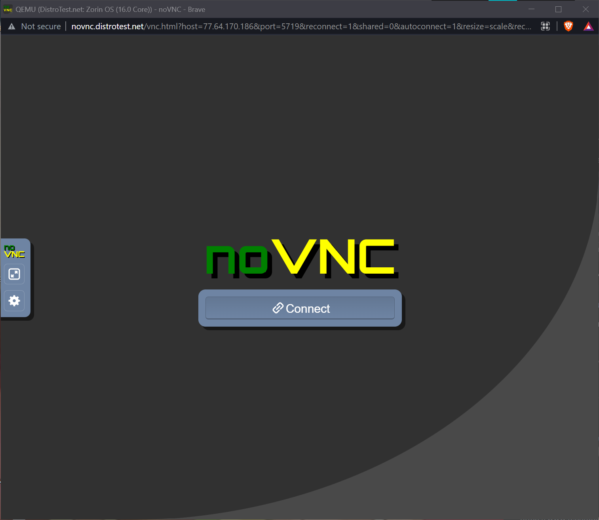

# Lab 1 Exploring Linux distributions

## Question 1 
1. What is the OS Type: **Linux**
2. Which major distro is it based on? **Debian**
3. Which processor architecture does it support? **armhf, ppc64el, riscv, s390x, x86_64**
4. Is the distribution active or is it discontinued? **Active**
5. What is the distro’s home page? **https://www.ubuntu.com/**
   
## Question 2
1. What is the name of the distribution and the OS Type: **SystemRescue and Linux**
2. Which major distro is it based on? **Arch**
3. Which processor architecture does it support? **i686, x86_64**
4. Is the distribution active or is it discontinued? **Active**
5. What is the distro’s home page? **http://www.system-rescue.org/**

## Question 3
1. What is the name of the distribution? **Netrunner**
2. What is the country of Origin? **Germany**
3. What major distribution is it based on? **Debian (Stable)**
4. What is the distribution category? **Beginners, Desktop, Live Medium**
5. Which processor architecture, aside from the one in the original query, does the OS support? **aarch64, armhf, x86_64**

## Question 4
A Linux distribution used for Data Rescue/Data recovery

|Distro Name |Website                       |Desktop Environment|
|------------|------------------------------|-------------------|    
|SystemRescue| http://www.system-rescue.org/| Xfce              |

A Linux distribution used for Education that supports the ix86 processor architecture.

|Distro Name    |Website                     |Desktop Environment               |
|---------------|----------------------------|----------------------------------|    
|Edu/Skolelinux |(http://www.skolelinux.org/)|GNOME, KDE, LXDE, LXQt, MATE, Xfce|

A Linux distribution that supports the OEM installation method

|Distro Name |Website                       |Desktop Environment  |
|------------|------------------------------|---------------------|    
|Linux Mint  | https://linuxmint.com/       |Cinnamon, MATE, Xfce |

## Question 5
The Cutefish OS project was submitted August 2021 and is currently pending evaluation. It focuses on making a better desktop experience by making it simple, beautiful and practical. Also promises to be secure and stable. It seems very promising and covers all of my requirements. Most desktop are practical but not cute at all. It is open source so anyone can try to understand how it works and collaborate.

## Question 6

