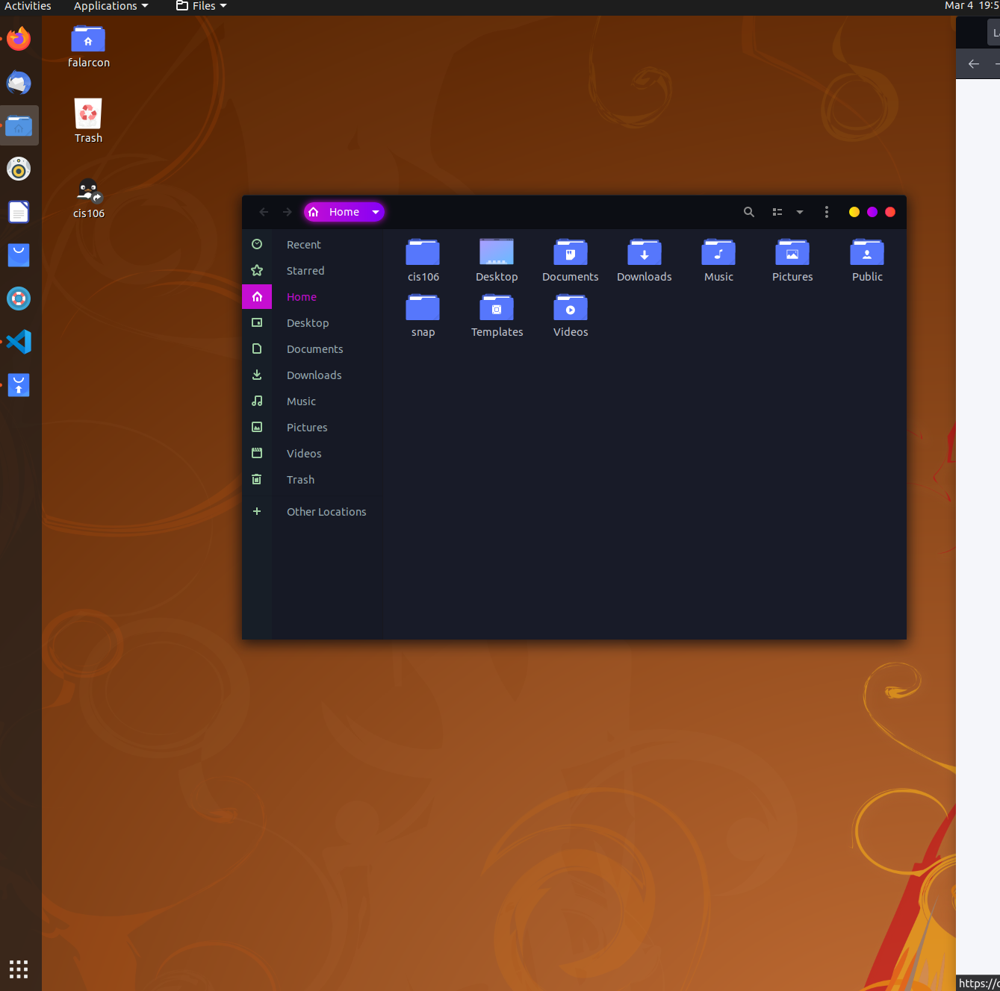

# Lab 3 Using Ubuntu

# Question 1 

# Question 2 

# Question 3

| Program purpose     | Package Name | Version            | Description |
| ------------------- | ------------ | ------------------ | ----------- |
| Play a tetris game  | quadrapassel | 1:3.36.0-1         | popular Russian game, similar to tetris |
| Play a video file   | dragonplayer | 4:19.12.3          | simple video player |
| Browse the internet | surf         | 2.0+git20190208-2  | Simple web browser |
| Read your email     | rainloop     | 1.12.1-2           | Simple, modern & fast web-based email client |
| Play music          | deepin-music |   5.0.1+ds-2       | music player with brilliant and tweakful UI |

commands Answers:
* Sub question 1: sudo apt install quadrapassel dragonplayer surf rainloop deepin-music -y
* Sub question 2: sudo apt remove quadrapassel dragonplayer surf rainloop deepin-music  -y
* Sub question 3: sudo apt install quadrapassel+ dragonplayer+ surf- rainloop- deepin-music-  -y

# Question 4

| command | what it does                                                   |
|---------|-----------------------                                         |
| echo    | display a line of text                                         |
| fortune |  print a random, hopefully interesting, adage                  |
| cowsay  | configurable speaking/thinking cow (and a bit more)            |
| lolcat  | rainbow coloring for text                                      |
| figlet  | display large characters made up of ordinary screen characters |
| toilet  | display large colourful characters                             |
| rig     | Random Identity Generator                                      |
