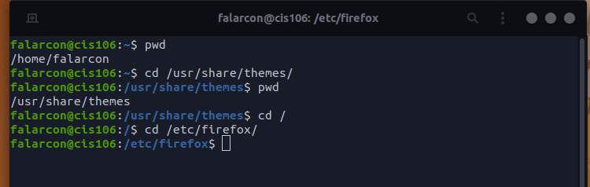
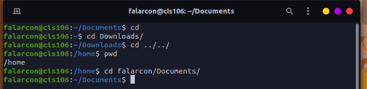
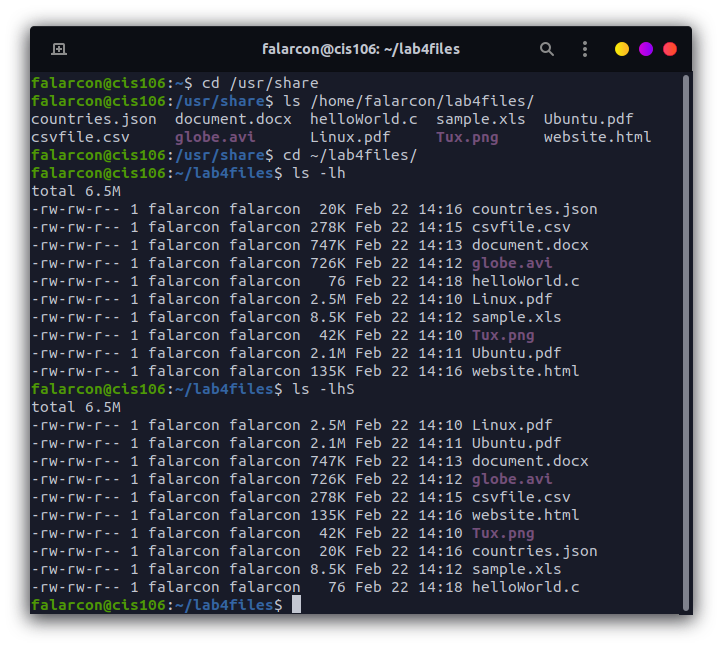
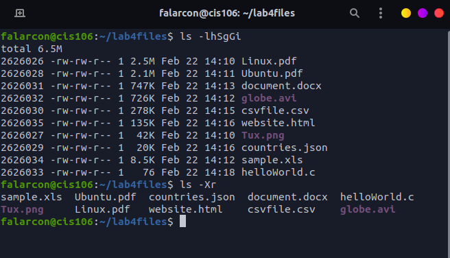
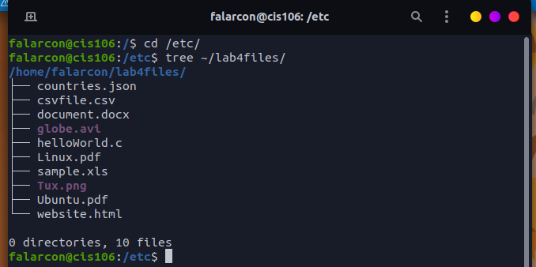
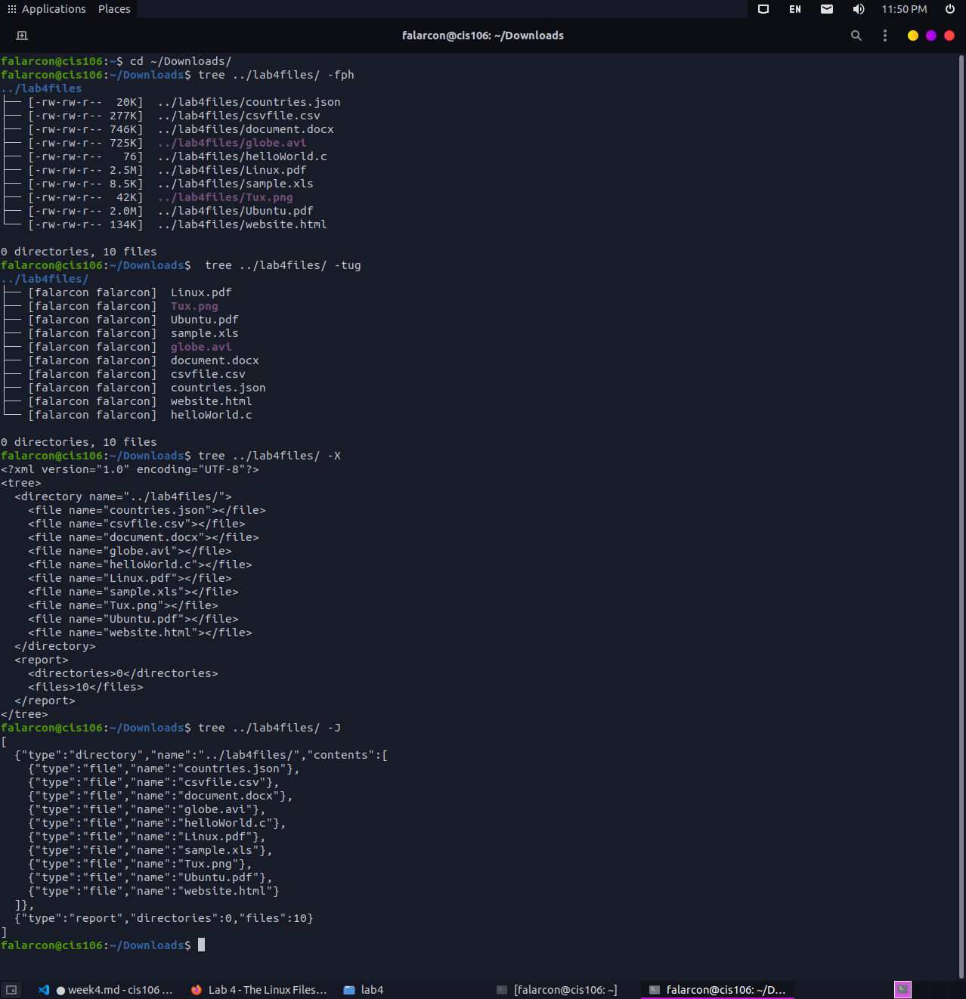
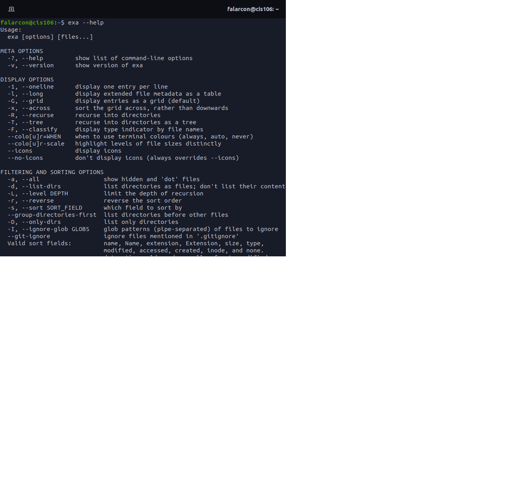
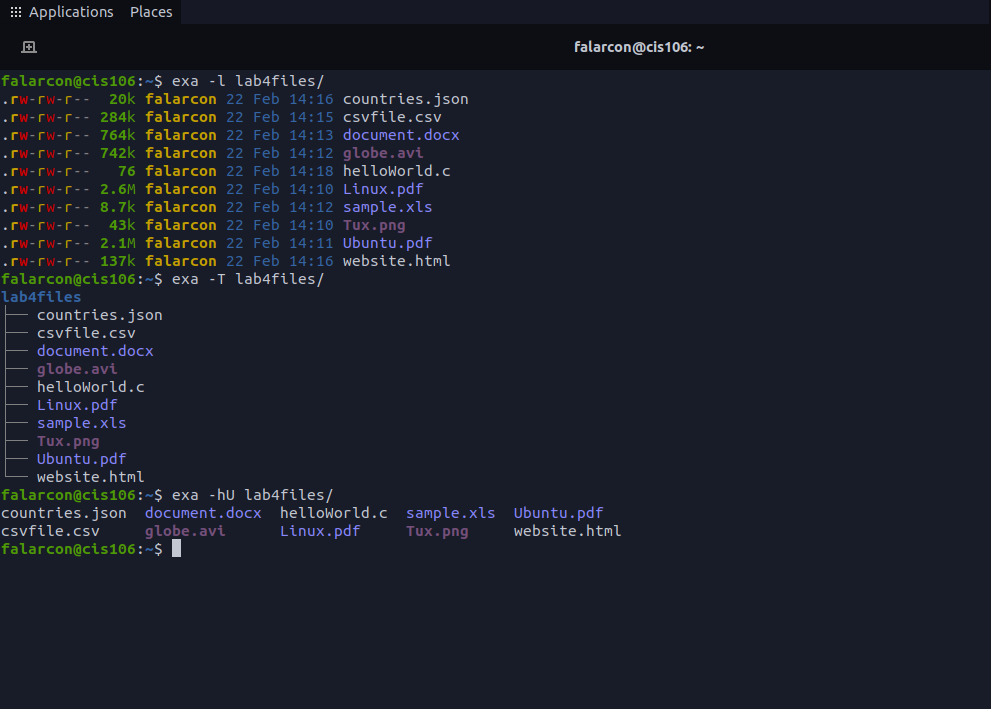

name: Fiorella Alarcon
class: cis106
semester: spring 22
---

# Lab 4 The Linux Filesystem

## Question 1 

### Table 1 

| Directory | Function                                                                                                                   |
| --------- | -------------------------------------------------------------------------------------------------------------------------- |
| bin       | essential commands                                                                                                         |
| dev       | device files                                                                                                               |         
| etc       | system configuration files                                                                                                 |
| home      | user home directories                                                                                                      | 
| media     | mount point for removable media, such as DVDs and floppy disks                                                             |
| opt       | add-on software packages                                                                                                   |
| proc      | kernel information, process control, system hardware information.                                                          |
| srv       | information relating to services that run on the system                                                                    |
| usr       | software not essential for system operation, such as applications                                                          |
| var       | dedicated to variable data, such as logs, databases, websites, and temp spool files that persist from one boot to the next |

### Table 2 

| Command | What it does                                    | Syntax                       | Example                |
| ------- | ----------------------------------------------- | ---------------------------- | -------                |
| cd      | changes the current directory                   | ```cd``` + ```destination``` | ```cd``` + ```$HOME``` |
| pwd     | displays current working directory              | ```pwd``` | ```pwd``` |
| ls      | displays all the files inside a given directory | ```ls```  | ```ls``` + ```-a``` |     

## Question 2 
<br>
<br>

## Question 3
<br>
<br>

## Question 4
<br>
<br>

## Question 5
<br>
<br>