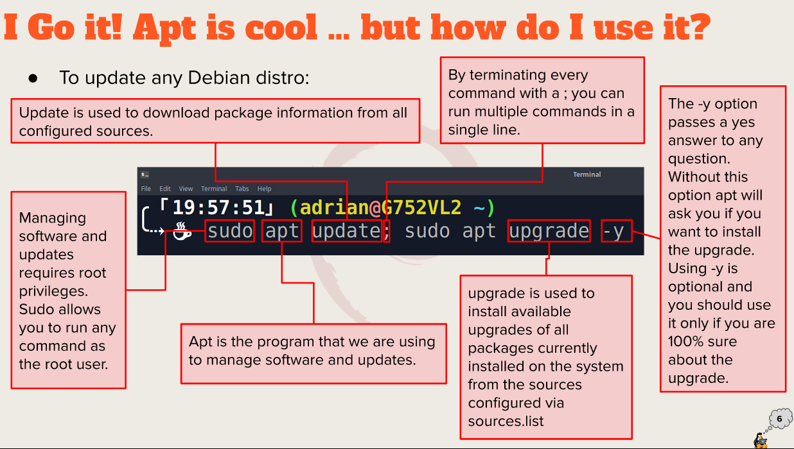
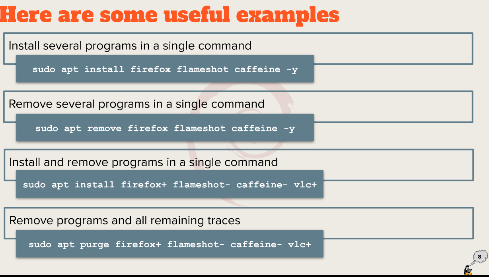

# Week Report 3

## Summary of presentations

### Exploring Desktop Environments
* Gnome
* MATE
* KDE
* XFCE
* BUDGIE
* LXDE

GUI: a graphical user interface is a set of programs that allow a user to interact with the computer system via icons, windows and various other visual elements.
DE: a desktop environment is an implementation of the desktop metaphor made of a bundle of programs running on top of a computer operating system, which shares a common GUI, sometimes described as a graphical shell. 

* Desktop settings 
* Desktop manager
* File manager
* Icons
* Favorites Bar
* Launcher
* Menus
* Panels
* System tray 
* Widgets
* Window Manager

### The bash Shell
Shell is a program that provides interactive access to the Linux system. It runs as a regular program and starts when a user logs in into a terminal. 

* Tcsh Shell
* Csh Shell
* Ksh Shell
* Zsh Shell
* Fish Shell

* Ctrl + A 
* Ctrl + E
* Ctrl + K
* Ctrl + U
* !! 
* !* 

* **date** displays the current time and date
* **cal** displays a calendar of the current month
* **df** displays the current amount of free space on our disk drives
* **free** displays information about your system
* **uname** displays information about your system
* **clears** clears the screen 

### Managing Software
* sudo apt update; sudo apt upgrade -y
* sudo apt install package name -y
* sudo apt remove package name -y
* apt search "app"

* Package: archives that contain binaries of software, configuration files, and information about dependencies.
* Library: reusable code that can be used by more than one function or program.
* Repository: A large collection of software available for download. 

