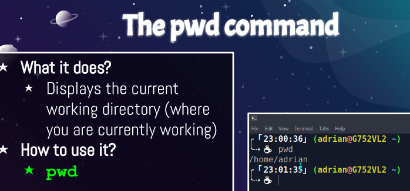
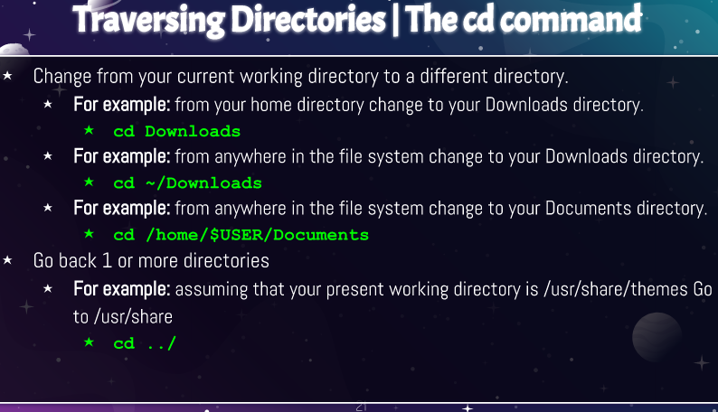
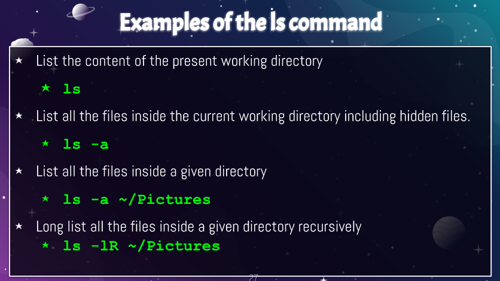

# Week Report 3

## Summary of presentations

| Commands | Function                                          | Example          |
| ---------| ------------------------------------------------- | ---------------- |
| pwd      | used for displaying the current working directory |  |
| cd       | changes the current working directory             |   |
| ls       | displays all the files inside a given directory   |   |

* File system: the way files are stored and organized to simplify access to data.
* Current directory: the directory where you are at the moment; present working directory 
* Parent directory: moving backwards to the previous directory 
* The difference between your home directory and the home directory: Your home directory refers to your users home directory. For example /home/maria is the home directory of Maria. The home directory refers to the home directory located in the root. For example /home.
* Pathname: indicates the location of the file in the filesystem, like an address
* Relative path: the location of a file starting from the current working directory or a directory that is located inside the current working directory.
* Absolute path: the location of a file starting at the root of the file system.

## What is the right to repair movement and why does it matter?

The right to repair is being able to go to someplace other than the manufacturer or dealer to repair a product if you chose to do so. Its important because it allows us to repair devices for a fraction of both the money it would normally cost in having them repaired from the manufacturer and as well as the time they would normally take.