# Week Report 5

## Definition, usage, and example of the following commands:
* **mkdir**:
  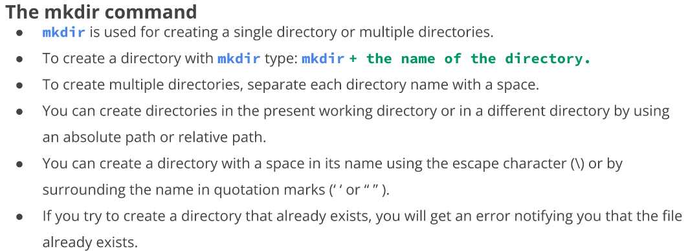
  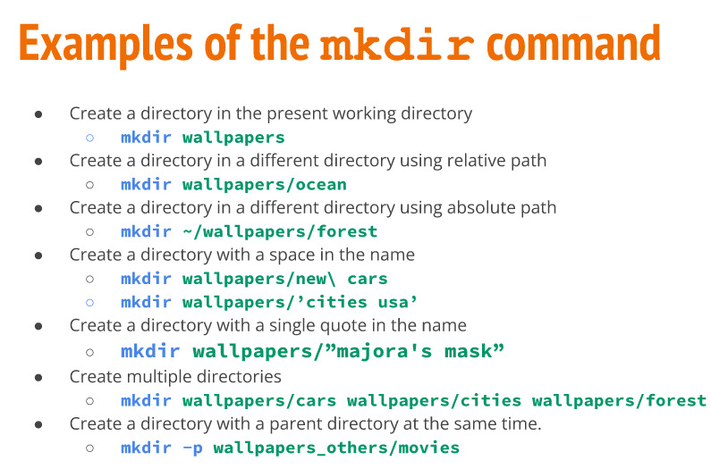
* **touch**: 
  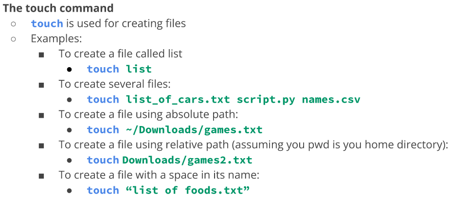
* **rm**:
   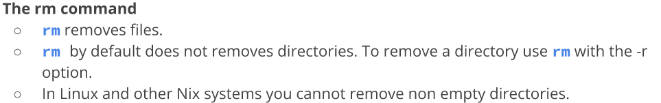
  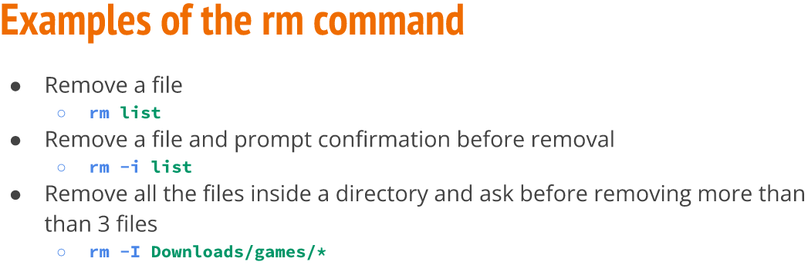
* **rmdir**:
  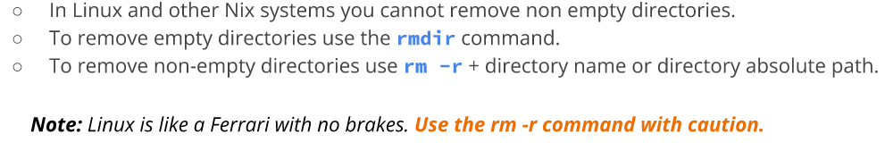
  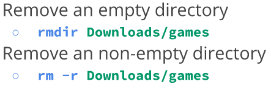  
* **mv**:
  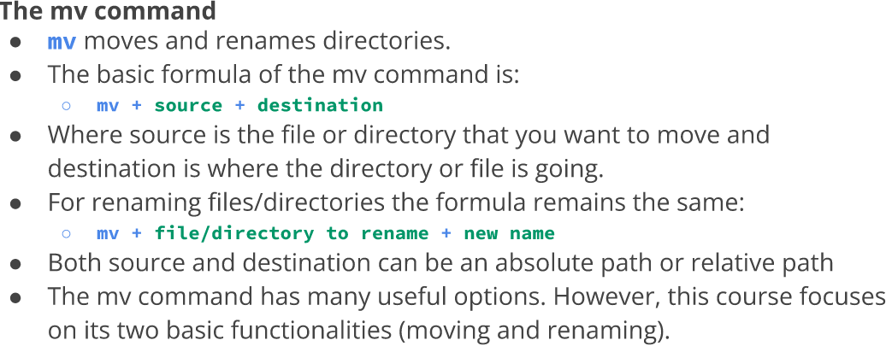
  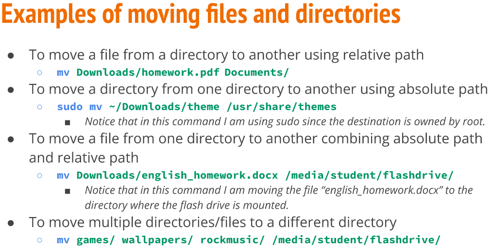
  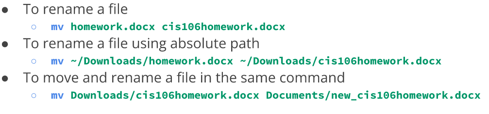
* **cp**:
  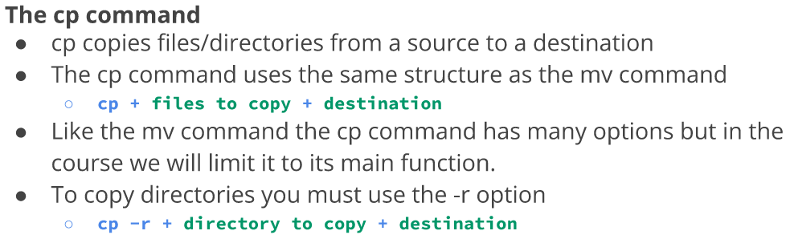
  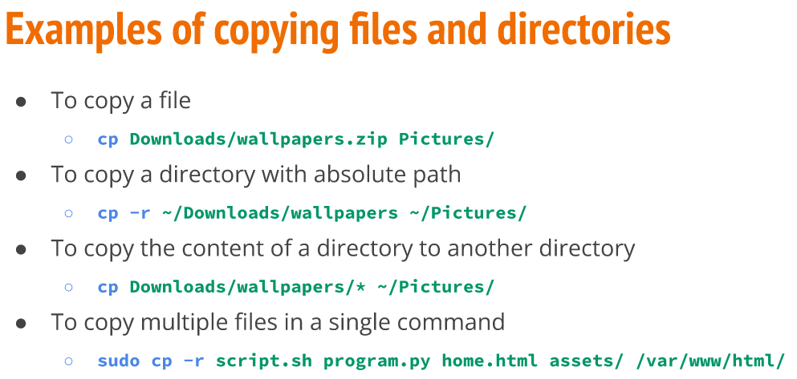
* **ln**:
  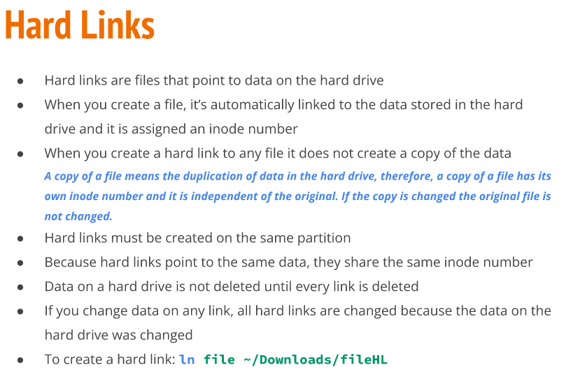
  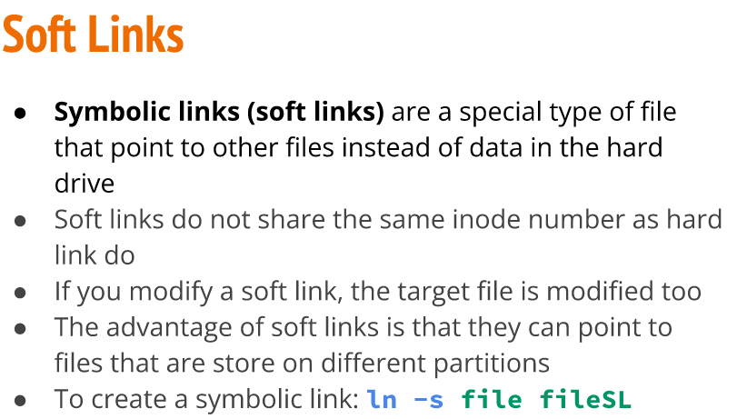
* **man**:
  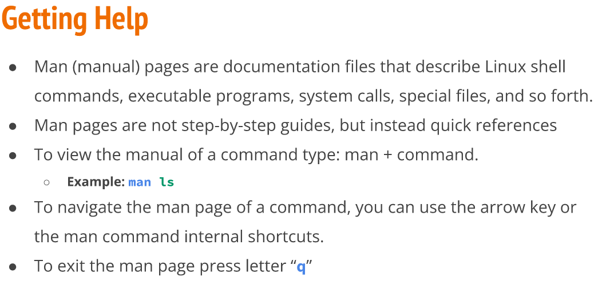
  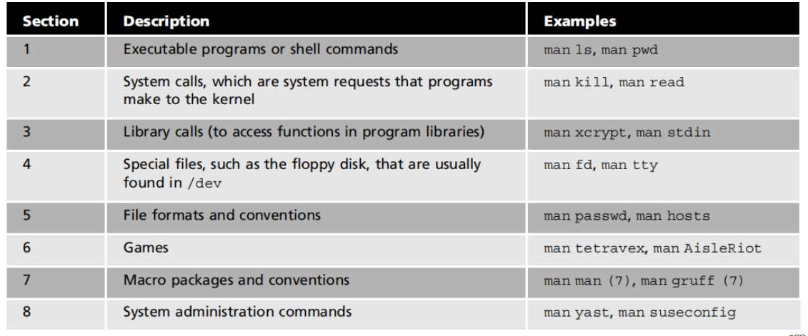

## Brace expansion and how to use it

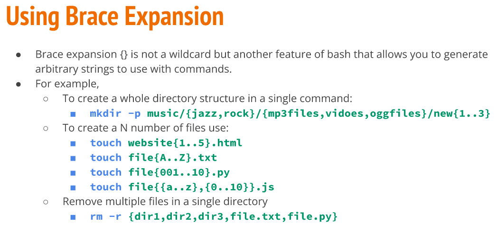
