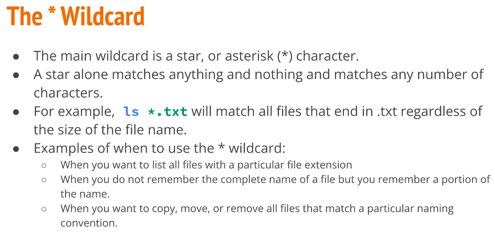
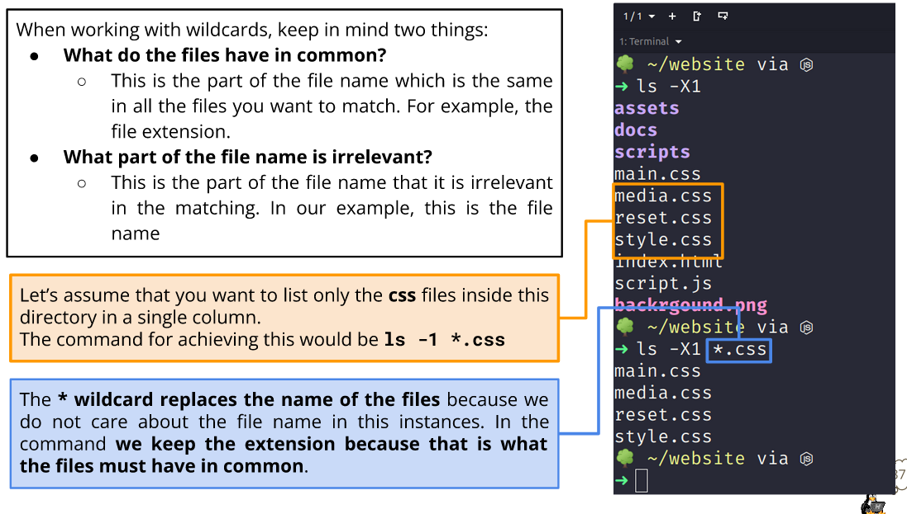
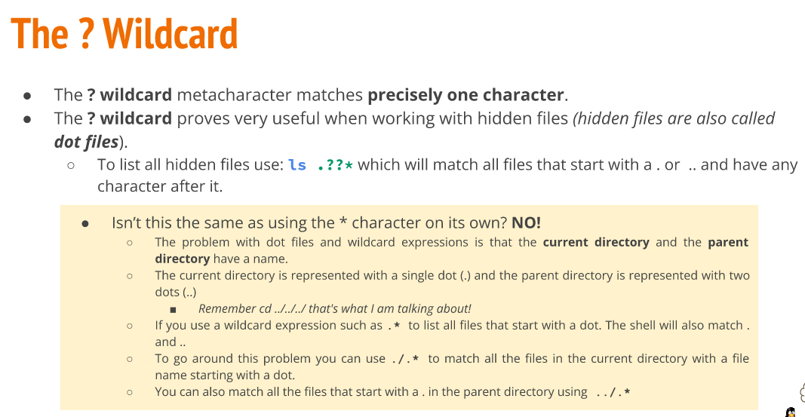
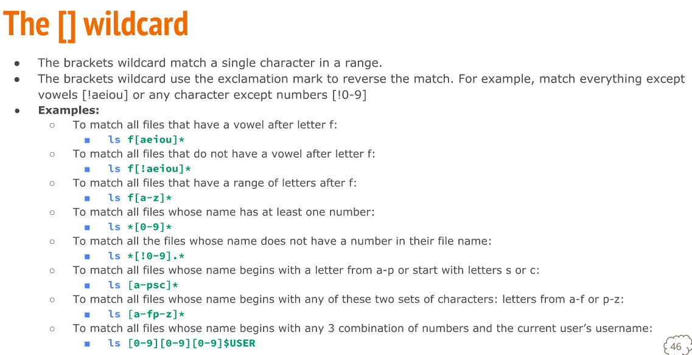
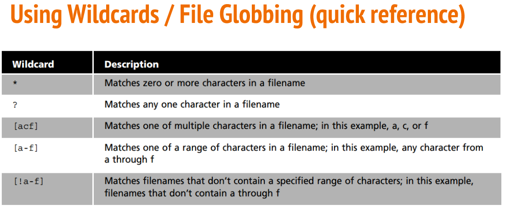
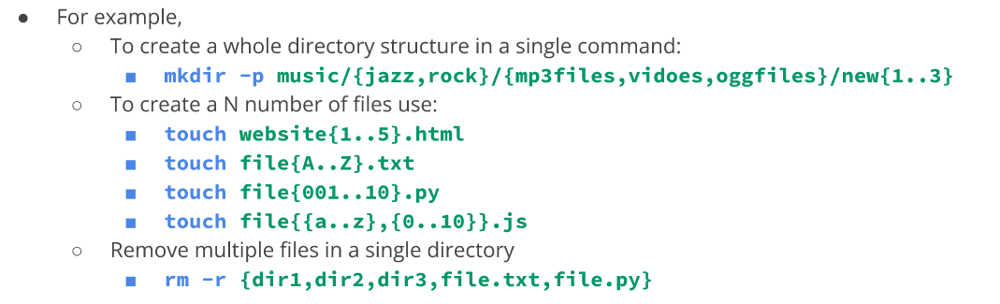

# Week Report 6

## Using Wildcads
Wildcards represent letters and characters used to specify a file name for searches. You can use a wildcard numerous ways such as to manage directories faster and move/delete group of files.

 

## Brace Expansion and how to use it 
Brace expansion is a feature of bash that allows you to generate arbitrary strings to use with commands. Similar to a wildcard.
 
